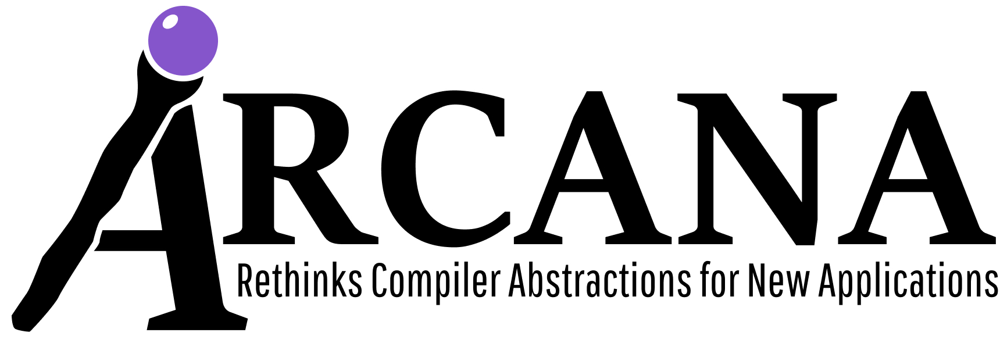

# <u>N</u>OELLE <u>O</u>ffers <u>E</u>mpowering <u>LL</u>VM <u>E</u>xtensions

[](https://gist.github.com/cheerfulstoic/d107229326a01ff0f333a1d3476e068d)

<p></p>

- [Description](#description)
- [Version](#version)
- [Status](#status)
- [Prerequisites](#prerequisites)
- [Building and Installing](#building-and-installing)
- [Testing](#testing)
- [Uninstalling](#uninstalling)
- [Repository structure](#repository-structure)
- [NOELLE as an external project](#NOELLE-as-an-external-project)
- [Projects built upon NOELLE](#Projects-built-upon-NOELLE)
- [Contributing](#contributing)
- [License](#license)

## Description
NOELLE provides abstractions to help build advanced code analyses and transformations for LLVM IR code.
It is built upon [SVF](https://svf-tools.github.io/SVF/), [SCAF](https://github.com/PrincetonUniversity/SCAF.git), and [LLVM](http://llvm.org).

[We](https://users.cs.northwestern.edu/~simonec/Team.html) released NOELLE's source code in the hope of enriching the resources available to the research community and compiler developers.
You are kindly asked to acknowledge usage of the tool by citing the following paper:
```
@inproceedings{NOELLE,
    title={{NOELLE} {O}ffers {E}mpowering {LL}VM {E}xtensions},
    author={Angelo Matni and Enrico Armenio Deiana and Yian Su and Lukas Gross and Souradip Ghosh and Sotiris Apostolakis and Ziyang Xu and Zujun Tan and Ishita Chaturvedi and David I. August and Simone Campanoni},
    booktitle={International Symposium on Code Generation and Optimization, 2022. CGO 2022.},
    year={2022}
}
```

The following material compose the documentation currently available:
- An introductory [video](https://www.youtube.com/watch?v=whORNUUWIjI)
- The [CGO 2022 Paper](https://users.cs.northwestern.edu/~simonec/files/Research/papers/HELIX_CGO_2022.pdf)
- The slides used during [Advanced Topics in Compilers](https://users.cs.northwestern.edu/~simonec/ATC.html) at Northwestern
- The [Github Wiki](https://github.com/arcana-lab/noelle/wiki) of the project
- Comments in the source code


## Version
The latest stable version is 14.0.1 (tag = `v14.0.1`).

#### Version Numbering Scheme
The version number is in the form of \[v _Major.Minor.Revision_ \]
- **Major**: Each major version matches a specific LLVM version (e.g., version 9 matches LLVM 9, version 11 matches LLVM 11)
- **Minor**: Starts from 0, each minor version represents either one or more API replacements/removals that might impact the users OR a forced update every six months (the minimum minor update frequency)
- **Revision**: Starts from 0; each revision version may include bug fixes or incremental improvements

#### Update Frequency
- **Major**: Matches the LLVM releases on a best-effort basis
- **Minor**: At least once per six months, at most once per month (1/month ~ 2/year)
- **Revision**: At least once per month, at most twice per week (2/week ~ 1/month)

## Status
Next is the status of NOELLE for different LLVM versions.

| LLVM    | NOELLE's branch |  SVF included      | SCAF included      | Working            | Maintained         | 
| ------: | --------------: | :----------------: | :----------------: | :----------------: | :----------------: |
|  18.1.8 | v18             | :x:                | :x:                | :x:                | :heavy_check_mark: |
|  14.0.6 | v14             | :heavy_check_mark: | :heavy_check_mark: | :heavy_check_mark: | :heavy_check_mark: |
|   9.0.0 | master          | :heavy_check_mark: | :heavy_check_mark: | :heavy_check_mark: | :heavy_check_mark: |


## Prerequisites
LLVM 18.1.6

### Northwestern users
Those who have access to the Zythos cluster at Northwestern can source LLVM 18.1.6 from any node of the cluster with:
```
source /project/extra/llvm/14.0.6/enable
```
Check out the Zythos cluster guide [here](http://www.cs.northwestern.edu/~simonec/files/Research/manuals/Zythos_guide.pdf) for more.


## Building and Installing

To build and install NOELLE you need to configure it first, unless the [default configuration](config.default.cmake) is satisfactory.
From the root directory:
```
make menuconfig     # to customize the installation
make                # set the number of jobs with JOBS=8 (default is 16)
```

To build with any other generator, e.g. **Ninja**, use `make GENERATOR=Ninja`.


## Testing
To run all tests, invoke the following commands:
```
cd tests
make clean    # optional but recommended
make
```

## Uninstalling

To uninstall NOELLE, please run the following commands:

Run `make uninstall` to uninstall without cleaning the build files.

Run `make clean` to reset the repository to its initial state.
For generality, the install directory is not removed.


## Repository structure

- `bin` contains the scripts through which the user will run all analyses and transformations
- `doc` contains the documentation
- `examples` contains examples of how to build LLVM pass that rely on NOELLE
- `src` contains the C++ source of the framework
- `src/core` contains all the main abstractions
- `src/tools` contains a set of tools built on top of the core. All tools are independent from one another
- `tests` contains unit tests

## NOELLE as an external project

NOELLE can be easily integrated your project with
[ExternalProject](https://cmake.org/cmake/help/latest/module/ExternalProject.html)
and [FetchContent](https://cmake.org/cmake/help/latest/module/FetchContent.html).

By using **ExternalProject**, cmake will download, compile and install the repository at build time.
By the time you compile your project, NOELLE will be already installed.

```cmake
include(ExternalProject)
ExternalProject_Add(
    noelle
    GIT_REPOSITORY  "https://github.com/arcana-lab/noelle.git"
    GIT_TAG         v14.0.1
    BUILD_COMMAND   ${CMAKE_COMMAND} --build . -j16
    INSTALL_COMMAND ${CMAKE_COMMAND} --install .
    CMAKE_ARGS
        -DCMAKE_INSTALL_PREFIX=${CMAKE_CURRENT_BINARY_DIR}/noelle
        -DNOELLE_SVF=OFF
        -DNOELLE_SCAF=OFF
)
include_directories(${CMAKE_CURRENT_BINARY_DIR}/noelle/include)
```

By using **FetchContent**, the repository will be made available as soon as cmake is run.
your project and noelle will then be compiled as a single project.

```cmake
include(FetchContent)
FetchContent_Declare(
    noelle
    GIT_REPOSITORY  "https://github.com/arcana-lab/noelle.git"
    GIT_TAG         v14.0.1
)
set(NOELLE_SVF OFF)
set(NOELLE_SCAF OFF)
FetchContent_MakeAvailable(noelle)
FetchContent_GetProperties(noelle)

# at this point noelle is available but NOT installed
include_directories(${noelle_SOURCE_DIR}/src/core/alloc_aa/include) # for example
```

## Projects built upon NOELLE
Several projects have already been built successfully upon NOELLE.
These projects are (in no particular order):
- [Gino](https://github.com/arcana-lab/gino)
- [MemOIR](https://github.com/arcana-lab/memoir)
- [HBC](https://github.com/arcana-lab/heartbeatcompiler)
- [CPF](https://github.com/PrincetonUniversity/cpf)
- [CARMOT](https://github.com/arcana-lab/carmot)
- [Alaska](https://github.com/nickwanninger/alaska)
- [TrackFM](https://github.com/compiler-disagg/TrackFM)
- [SPLENDID](https://dl.acm.org/doi/10.1145/3582016.3582058)
- [WARIO](https://github.com/TUDSSL/WARio)
- [CCK](https://github.com/arcana-lab/cck)
- [Compiler-based timing](https://dl.acm.org/doi/10.5555/3433701.3433771)
- [PRV Jeeves](https://dl.acm.org/doi/abs/10.1145/3368826.3377906)
- [CARAT](https://dl.acm.org/doi/10.1145/3385412.3385987)
- [STATS](https://dl.acm.org/doi/10.1145/3173162.3173181)
- [Time squeezer](https://dl.acm.org/doi/10.1145/3307650.3322268)


## Contributing
We welcome contributions from the community to improve this framework and evolve it to cater for more users.

NOELLE uses `clang-format` to ensure uniform styling across the project's source code.
To format all `.cpp` and `.hpp` files in the repository run `make format` from the root.
`clang-format` is run automatically as a pre-commit git hook, meaning that when you commit a file `clang-format` is automatically run on the file in-place.

Since git doesn't allow for git hooks to be installed when you clone the repository,
cmake will install the pre-commit git hook upon installation.

If you have any trouble using this framework feel free to reach out to us for help (contact simone.campanoni@northwestern.edu).

## License
NOELLE is licensed under the [MIT License](./LICENSE.md).
